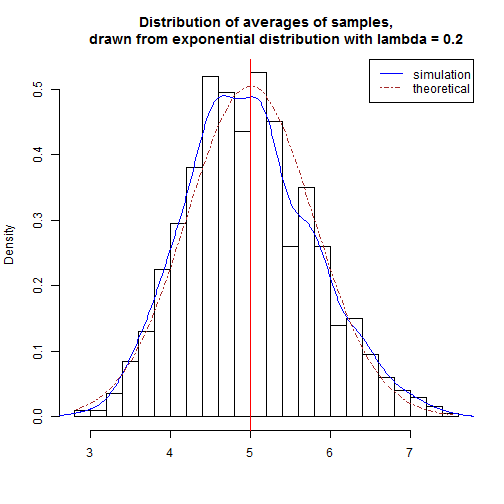
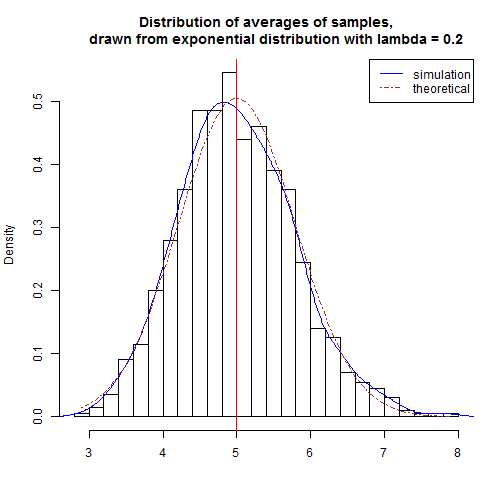
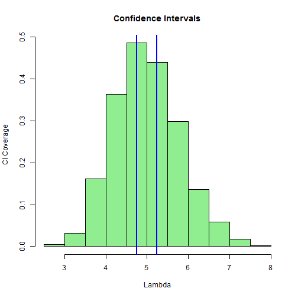

## Statistical Inference Assigment 1

The exponential distribution can be simulated in R with rexp(n, lambda) where lambda $ \lambda $ is the rate parameter. The mean of exponential distribution is $ 1/\lambda $ and the standard deviation is also $ 1/\lambda $.
For this simulation, we set $ \lambda=0.2 $ and then we investigate the distribution of averages of 40 numbers sampled from exponential distribution with $ \lambda=0.2 $.

We are going to do 1000 simulated averages of 40 exponentials.

```r
library(knitr)
library(rmarkdown)
```

```r
lambda <- 0.2
n <- 40
n_sims <- 1000
means <- data.frame(x = sapply(n_sims, function(x) {mean(rexp(n, lambda))}))
sim <- matrix(rexp(n_sims * n, rate = lambda), n_sims, n)
row_means <- rowMeans(sim)
```

The distribution of sample means is as follows.


```r
# Plotting the histogram of averages
hist(row_means, breaks = 20, prob = TRUE,
     main = "Distribution of averages of samples,
     drawn from exponential distribution with lambda = 0.2",
     xlab = "")

# Density of the averages of samples
lines(density(row_means), pch = 20, col = "blue", lty = 1)

# Theoretical center of distribution
abline(v = 1 / lambda, col = "red")

# Theoretical density of the averages of samples
x_theo_fit <- seq(min(row_means), max(row_means), length = 100)

y_theo_fit <- dnorm(x_theo_fit, mean = 1 / lambda, sd = (1 / lambda / sqrt(n)))

lines(x_theo_fit, y_theo_fit, pch = 35, col = "brown", lty = 10)

legend('topright', c("simulation", "theoretical"), lty = c(1,10), col = c("blue", "brown"))
```

 

### Question 1 - Show where the distribution is centered at and compare it to the theoretical center of the distribution.
The chart shows that distribution of the mean of 40 exponential(0.2)s is approximately normal. The distribution is centered at 4.9898156 and the theoretical center of the distribution is $ \lambda^{-1} $ = 5.

### Question 2 - Show how variable it is and compare it to the theoretical variance of the distribution.
The variance of sample means is 0.630726 where the theoretical variance of the distribution is $\sigma^2 / n = 1/(\lambda^2 n) = 1/(0.04 \times 40)$ = 0.625.


As demonstrated by the central limit theorem, the averages of the samples follow normal distribution. The figure above also shows the density computed using the histogram and the normal density plotted with theoretical mean and variance values.


### Question 3 - Show that the distribution is approximately normal.

An additional check for normality conducted using the q-q plot also suggests the data to be normally distributed.


```r
qqnorm(row_means); qqline(row_means)
```

 

### Question 4 - Evaluate the coverage of the confidence interval for $1/\lambda = \bar{X} \pm 1.96 \frac{S}{\sqrt{n}}$


```r
means_exp <- apply(sim, 1, mean)
CI_coverage <- round(mean(means_exp) + c(-1, 1) * 1.96 * (sd(means_exp) / sqrt(40)), 3)
CI_coverage
```

```
## [1] 4.744 5.236
```

For the lower and upper bounds, the 95% confidence interval is 4.744 - 5.236.  

The following chart shows this scenario.


```r
#Plotting the results
hist(means_exp, breaks=10, prob = TRUE, col = "lightgreen", main = "Confidence Intervals", xlab = "Lambda", ylab = "CI Coverage")
     
    abline(v = CI_coverage, col= "blue", lwd = 2)
```

 

